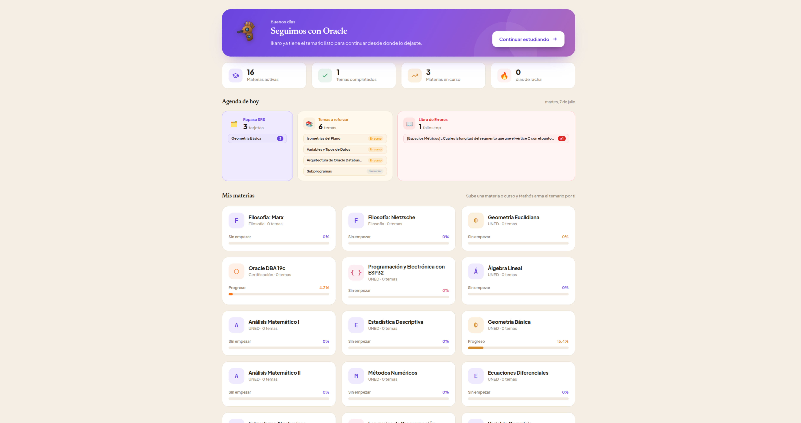
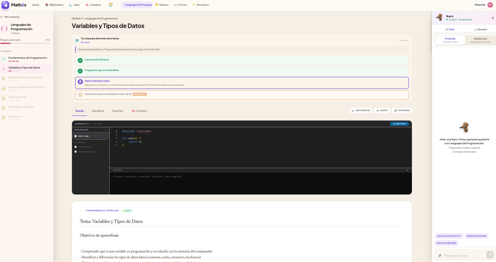
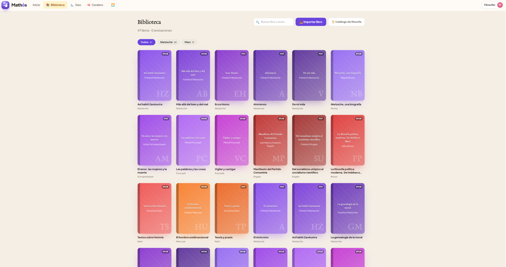
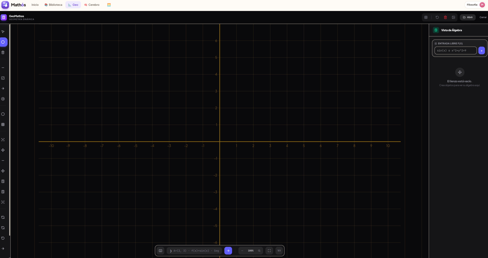
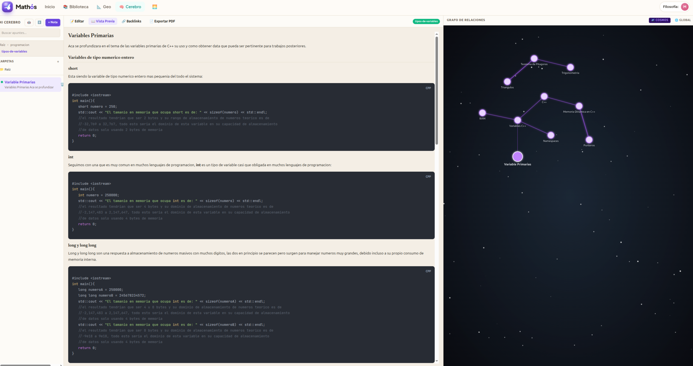
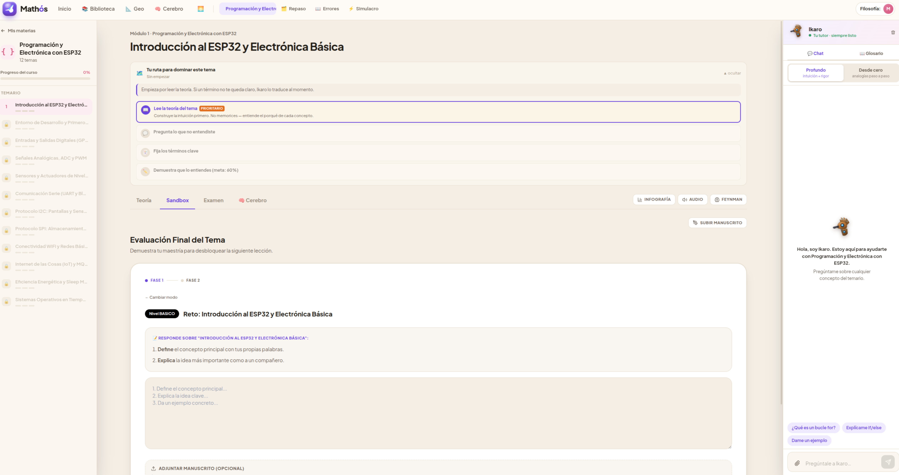
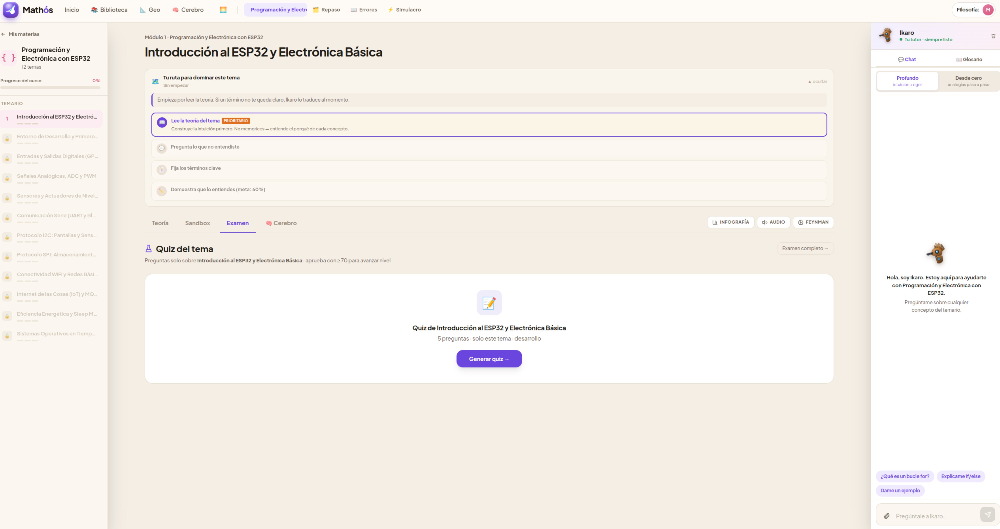
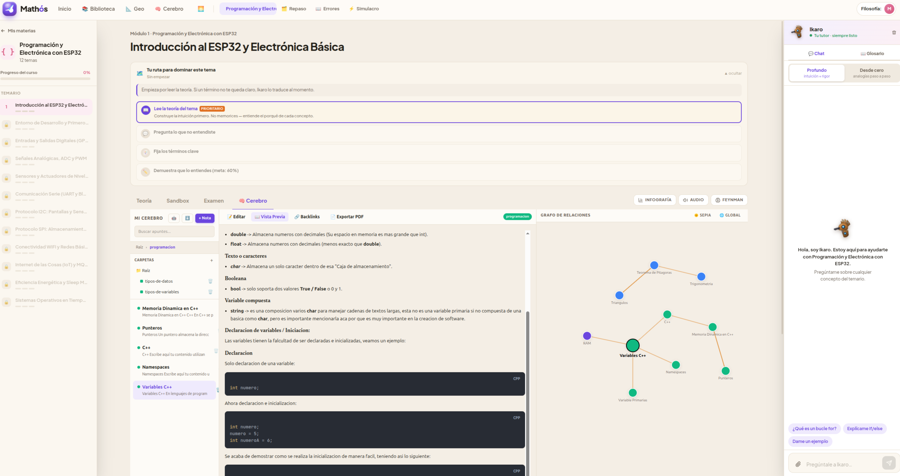
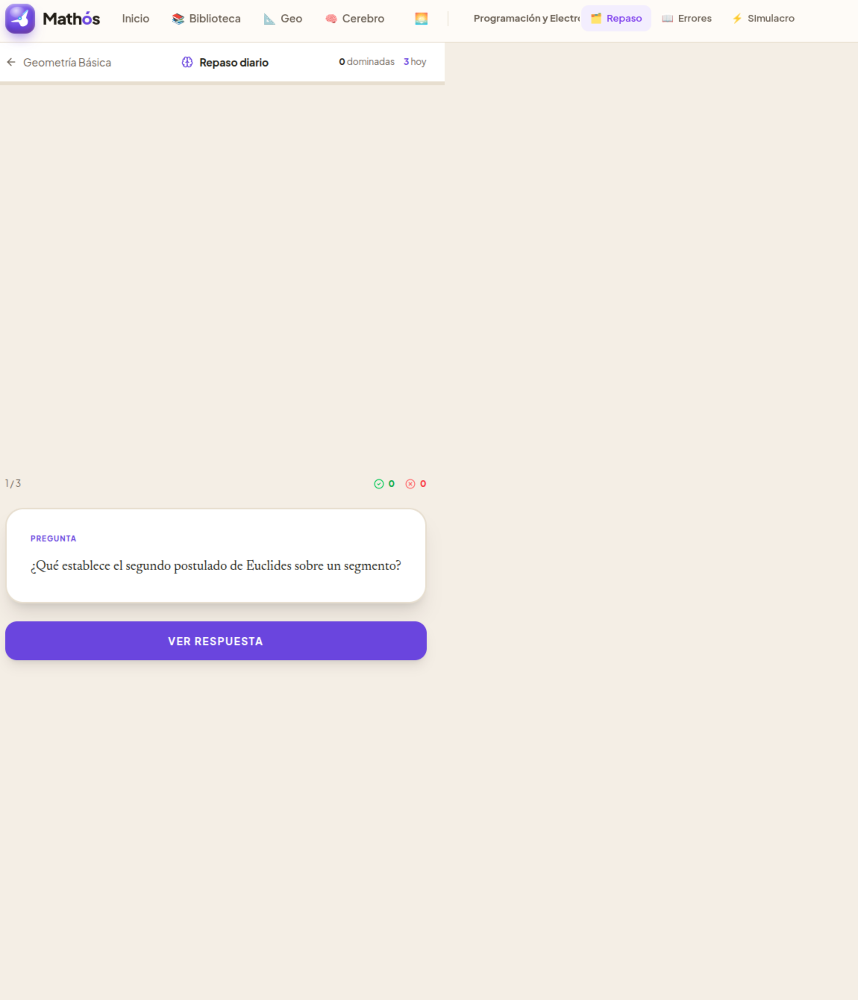

# Mathós — Plataforma de Estudio Asistido por IA

**Mathós** (del griego μάθος, "aprendizaje") es una plataforma web integral diseñada para potenciar **estudios independientes, cualquier grado universitario y certificaciones profesionales** mediante asistencia avanzada de IA.

Inicialmente validada para el Grado de Matemáticas y certificaciones técnicas (Oracle DBA), su arquitectura modular permite dominar cualquier disciplina. Destaca por estar potenciada con un **sistema de GraphRAG** (Retrieval-Augmented Generation basado en grafos de conocimiento), además de contar con sandbox de compilación C++, sandbox SQL, evaluación automática en 2 fases, simulacro de examen, sistema de repaso espaciado SM-2, el editor geométrico GeoMathos como potenciador de estudio, biblioteca digital con lector EPUB/PDF, y progresión adaptativa por temas.

## Estado actual

## Galería de Pantallas












| Componente | Estado | Notas |
|-----------|--------|-------|
| Backend API | ✅ ~99% | 46+ endpoints en 14 routers |
| Frontend React | ✅ ~99% | 12 páginas, 15+ componentes |
| Asistente IA con GraphRAG | ✅ | **GraphRAG** + TurboVec + DeepSeek/QWEN/Gemini, teoría cacheada 7 días |
| **Autenticación multi-usuario** | ✅ **Segurizado** | JWT HS256 + bcrypt + **whitelist de emails** (`ALLOWED_EMAILS`) |
| **GeoMathos** (Editor geométrico) | ✅ **Rediseñado** | Geometría dinámica SVG, Tailwind CSS, Lucide icons, glassmorphism, 17 herramientas |
| **Cerebro** (Segundo cerebro) | ✅ **Mejorado** | Tema Cosmos 🌌, Paneo de grafo, Auto-healing de enlaces, Persistencia PostgreSQL, Ikaro integrado |
| **Lector EPUB** | ✅ **Corregido** | Botón 💡 → Cerebro funcional (UUID en IDs, flash visual confirmación, toast éxito/error) |
| **Lector PDF** | ✅ **Mejorado** | react-pdf con selección real de texto; modal "Citar en Cerebro" |
| **Biblioteca** | ✅ **Mejorado** | Importación de libros propios (.epub/.pdf) via explorador de archivos + drag & drop |
| **Importador de Libros** | ✅ **Nuevo** | Upload multipart al backend, metadatos (título, autor, colección, color), preview en vivo |
| **Almacenamiento de Libros** | ✅ **Nuevo** | Configurable via `UPLOADS_DIR` en `.env`; volumen persistente en Docker |
| **Agenda del día** | ✅ | Dashboard consolidado: SRS vencidas + temas pendientes + errores frecuentes |
| **Andamio conceptual IA** | ✅ | Intuición visual y analogías antes de la teoría formal |
| **Atomización de demostraciones** | ✅ | Descompone teoremas en pasos lógicos + flashcards SRS |
| **Glosario dual** | ✅ | Formal ↔ informal, auto-llenado por IA tras cada respuesta |
| **Resolución visual de problemas** | ✅ | Canvas interactivo + Gemini Vision evalúa 3 niveles de dificultad |
| Ruta adaptativa | ✅ | Plan de estudio personalizado por nivel de dominio + detección real de actividad |
| **Layout A/C toggle** | ✅ | Modo clásico (sidebar siempre visible) o enfocado (FAB flotante) |
| SRS SM-2 (Flashcards) | ✅ | Repaso espaciado con flip cards, 4 niveles calificación |
| Gráficas interactivas SVG | ✅ | GraficaRenderer: funciones, barras, dispersión, tooltips |
| Simulacro de Examen | ✅ | Desarrollo (IA) + MCQ instantáneo Oracle 1Z0-082 (63% umbral) |
| Evaluación 2 fases | ✅ | Test conceptual (50%) + Taller práctico (50%) |
| Sandbox C++ | ✅ | Monaco Editor + compilación g++ via kernel Drogon, multi-archivo (.h/.cpp) |
| Sandbox SQL | ✅ | Esquema HR Oracle (107 empleados), análisis IA de SQL |
| Tests automatizados | ❌ Pendiente | Sin cobertura |


## Módulos

### Lenguajes de Programación (UNED, código 6102210-)
- Monaco Editor con resaltado C++, autocompletado, indentación
- File Explorer lateral multi-archivo (main.cpp, funciones.h, funciones.cpp)
- Compilación con g++ via kernel Drogon
- Asistente IA con RAG sobre apuntes UNED + libros de filosofía
- Evaluación en 2 fases: Test conceptual → Taller de código
- Gráficas interactivas de funciones matemáticas
- Flashcards de repaso espaciado SM-2

### Programación y Electrónica con ESP32 (IOT-ESP32)
- 12 temas desde electrónica básica hasta IoT y FreeRTOS
- Web Serial API para conexión directa con el microcontrolador desde el navegador
- Compilación de código C++/Arduino en el backend
- Monitor Serie integrado en la web

### Geometría Básica (UNED, código 61021105)
- Infografías Mermaid auto-generadas
- Renderizado LaTeX con KaTeX
- Lector de ejercicios con Gemini Vision
- Evaluación en 2 fases: Test conceptual → Ejercicio práctico
- Canvas geométrico con 9 herramientas de dibujo
- Gráficas interactivas de curvas y figuras
- **ProblemaVisual**: Canvas interactivo con generación de problemas por IA (3 niveles)
- **GeoMathos**: Editor geométrico SVG completo (Phase 1-4A, 17 herramientas)

### Oracle Database Administration I (1Z0-082)
- 12 temas de administración Oracle 19c
- Sandbox SQL con esquema HR Oracle (107 empleados)
- Simulacro MCQ con 20 preguntas, corrección instantánea
- Umbral de aprobado 63% (como el examen real)
- Taller SQL con análisis IA

### Biblioteca Digital
- 32 libros de filosofía pre-cargados (Nietzsche, Marx, Hegel, Lenin, Gramsci, Althusser)
- Seed automático idempotente via `POST /api/v1/libros/seed`
- **Importador de libros propios** — drag & drop o explorador de archivos (.epub/.pdf), con campos de metadatos (título, autor, colección/materia, color de portada, descripción) y preview en vivo
- Portadas auto-generadas con gradiente de color
- Búsqueda en tiempo real por título o autor
- Badge 🧠 N en portadas con extractos en Cerebro

### Lector EPUB/PDF
- **4 temas de lectura:** Claro ☀️, Sepia 📜, Oscuro 🌙, OLED ⚫
- **3 fuentes:** EB Garamond, Georgia, Inter
- **Ajustes:** Tamaño letra (12-28px), interlineado (1.2-2.4)
- **Anotaciones:** Highlights en 5 colores, notas, bookmarks
- **Navegación:** Tabla de contenidos, atajos teclado (←/→, a/d, j/k)
- **Progreso:** Guardado automático, restaura posición al recargar
- **Fullscreen:** Vista completa sin distracciones
- **Envío a Cerebro:** Selecciona texto → 💡 → nota creada al instante con toast de confirmación (verde ✅ / rojo ⚠️)
- Persistencia de preferencias en localStorage

### GeoMathos — Potenciador de Estudio y Graficación
GeoMathos no es solo un lienzo de dibujo, es un **potenciador del pensamiento matemático** que permite visualizar, explorar y graficar conceptos geométricos y algebraicos en tiempo real para acelerar la intuición:
- **17 herramientas:** Punto, Segmento, Recta infinita, Semirrecta, Vector, Círculo, Punto medio, Recta paralela, Recta perpendicular, Mediatriz, Bisectriz de ángulo, Intersección, Polígono, Ángulo, Borrar, Mover
- **Sistema de coordenadas:** Grid con ejes cartesianos etiquetados (−9 a +9)
- **Zoom/Pan:** Rueda de ratón zoom-to-cursor (0.01x–50x), Shift+arrastrar o click medio para pan, botones +/− y 1:1
- **Barra de comandos avanzada:** Creación/edición interactiva de puntos por coordenadas y de figuras mediante comandos de geometría nativos (`Segmento`, `Recta`, `Vector`, `Circulo`, etc.) con tooltips de warning en tiempo real.
- **Teclado Matemático Virtual:** Panel flotante desplegable (`⌨️`) con grid de 3 columnas (Números/Operadores, Constantes/Funciones y Geo-Comandos) con inserción inteligente respetando la posición del cursor de texto y botón de retroceso (`⌫`).
- **Límites de Dominio:** Capacidad de restringir curvas matemáticas delimitando su intervalo en formato `f(x) [a, b]`.
- **Intersección por Bisección:** Buscador numérico de raíces por bisección con precisión extrema ($10^{-6}$) para marcar puntos de convergencia entre cualquier par de curvas.
- **Editor de coordenadas y Vista de Álgebra:** Lista interactiva lateral con show/hide, delete y edición por doble clic.
- **Polígonos:** N vértices, snap visual al cerrar, muestra perímetro + área (fórmula de Gauss)
- **Historial:** Undo hasta 40 pasos
- **Export:** PNG nativo, envío a Ikaro (canal compartido)
- **Fit all:** Botón ⊡ que calcula zoom/pan óptimos para mostrar todos los puntos
- **Snap visual:** Anillo violeta al acercarse a puntos existentes (14px)

### Cerebro — Segundo cerebro de apuntes (Estilo Obsidian)
- **Markdown + LaTeX:** Redacción de notas enriquecidas con fórmulas matemáticas en bloque (`$$ecuación$$`) y en línea (`$ecuación$`), listas y bloques de código C++ estructurados.
- **Grafo de Relaciones Físico (60 FPS):** Visualización interactiva de tu red de conocimiento en un lienzo SVG flotante auto-organizado mediante simulación física 2D en tiempo real. 
- **Tema Cosmos y Paneo:** Soporte para modo "Cosmos" (fondo estrellado espacial interactivo) y navegación (panning) infinita con el mouse a través de todo tu mapa de conocimiento.
- **Auto-Healing Conceptual:** Escaneo automático de la base de datos al inicio para detectar etiquetas huérfanas o rotas y restaurar/reparar enlaces permanentemente.
- **Enlaces Wiki Bidireccionales (`[[Link]]`):** Conexión conceptual directa. Al hacer clic en un enlace de concepto en la vista previa, el sistema abre la nota correspondiente; si no existe, la crea en el acto y dibuja la conexión elástica en el grafo.
- **Persistencia en PostgreSQL:** Sincronización automática con el backend con limpieza y `keepalive` en cierre o navegación, garantizando 100% retención de grafos.
- **Ikaro integrado como asistente contextual:** Botón 🤖 en la barra del Cerebro abre un panel lateral donde Ikaro recibe automáticamente el contenido de la nota activa como contexto.
- **Gestión de Conocimiento:** Interfaz integrada en el explorador lateral para eliminar notas individuales y carpetas completas (de forma recursiva), limpiando automáticamente los enlaces huérfanos.
- **Exportación ZIP/Markdown:** Botón para exportar todo el grafo de conocimiento como `.zip` con un `.md` por nota, compatible con Obsidian.

### Libro de Errores
- Heat map visual por frecuencia de fallos
- Filtros por fuente: simulacro, taller, SRS, problema_visual
- Orden por frecuencia o recencia
- Simulacro dirigido desde errores
- Umbrales de color: ⚪ 1-2, 🟠 3-4, 🔴 5+

## Funcionalidades clave

### 📚 Biblioteca y Lector
- 32 libros de filosofía + **importación de cualquier libro propio (.epub/.pdf)**
- **Badge 🧠 N** en portadas: muestra cuántos extractos del libro ya tienes en Tu Cerebro
- Lector EPUB/PDF con 4 temas visuales, 3 fuentes, anotaciones, progreso automático
- **EPUB:** Selección de texto → menú popup con botón 💡 "Enviar a Mi Cerebro", crea nota instantáneamente con flash visual + toast de confirmación
- **PDF:** Visor react-pdf con selección real de texto; botón 💡 fijo en barra superior abre modal "Citar en Mi Cerebro" prerellenado con el texto seleccionado
- Flujo de conocimiento: **Biblioteca → Lector → Cerebro**
- Atajos de teclado y fullscreen

### 📎 Adjuntos en Chat Ikaro
- Subir imágenes (JPEG/PNG/WebP/GIF) o PDFs (máx 15 MB)
- Gemini Vision transcribe contenido visual
- DeepSeek responde con contexto del archivo
- Thumbnails en el historial del chat

### 🧠 Tutor Empático (Ikaro)
- **Detección de confusión:** 34 señales textuales ("no entiendo", "me perdí", "salió mal")
- Respuesta estructurada en 3 partes: identifica malentendido → intuición llana → formalismo
- **Contexto de errores:** Inyecta tests fallados recientes para que la IA adapte su respuesta
- **Evaluación contextual:** Usa la teoría cacheada del tema como referencia primaria + RAG como suplemento. El modo técnico se adapta a la disciplina (humanidades ≠ ciencias)
- **Modo chat "Desde cero":** Sin RAG para repaso sin contexto
- **Auto-glosario:** Tras cada respuesta, extrae hasta 5 términos y los upserta automáticamente

### 📖 Glosario dual contextual
- Definiciones formal ↔ informal de términos matemáticos
- Búsqueda en vivo con debounce 300ms
- Ejemplos por término
- Construido incrementalmente por IA sin intervención manual

### 🃏 SRS SM-2 (Spaced Repetition System)
- Algoritmo SM-2 puro (SuperMemo-2): intervalo, facilidad, repeticiones
- Generación automática de flashcards vía IA por tema
- Flip cards con animación framer-motion
- 4 niveles de calificación: olvidado (0-1), difícil (2), normal (3-4), fácil (5)
- Registro de errores para análisis posterior
- Endpoints: generar, cola del día, revisar, stats, errores

### 🔬 Atomización de Demostraciones
- Descompone teoremas en pasos atómicos (máx 7)
- Cada paso: premisa → conclusión + razón llana + razón formal
- Flashcard SRS por paso automáticamente
- Formulario para atomizar teoremas por input del usuario
- Cadena visual expandible con QED al final

### 🧩 Andamio Conceptual (Concept-First)
- Título intuitivo, pregunta gancho, imagen mental, analogía, propósito
- Cacheado en disco (regeneración opcional)
- Visible antes de la teoría formal (reduce ansiedad matemática)
- Botón "Entendido, ver teoría →" para colapsar

### 📝 Evaluación en 2 Fases
```
Test conceptual (50%) → resultado → Taller práctico (50%) → nota combinada → tema completado
```
- **Fase 1:** Preguntas guiadas (Define, Explica, Da un ejemplo, Relaciona)
- **Fase 2:** Taller adaptativo por materia (código C++, resolución de ejercicios, o SQL)
- Nota final ≥ 70 para aprobar. Ambas fases obligatorias.
- `puntuacion_maxima` en Dominio para seguimiento del mejor resultado

### 🎨 Resolución Visual de Problemas
- Exclusivo para materias matemáticas (geometría, álgebra, cálculo, estadística)
- Generación de problemas geométricos por IA con primitivas canvas (point, line, circle, rect, angle, text)
- 3 niveles de dificultad: básico, intermedio, avanzado
- Canvas interactivo: lápiz, segmento, punto, borrador, selector de color y grosor
- Editor de explicación con soporte LaTeX inline/display + barra (x², √, π, ±, ∴, frac)
- Adjuntar trabajo manuscrito (imagen o PDF)
- Evaluación con Gemini Vision: devuelve puntuación, feedback, aciertos, errores
- Auto-registro en Libro de Errores si puntuación < 70

### 📈 Ruta Adaptativa
- Plan de estudio personalizado según nivel de dominio actual
- **Detección real de actividad:** Consulta sesiones de estudio reales — los pasos "Asistente" y "Flashcards" se marcan completados solo si se usaron, no por inferencia de nivel
- Registro automático: primer chat con Ikaro vía `POST /temas/{id}/estudiar tipo=chat`, generación de flashcards vía `tipo=ejercicio`
- Pasos dinámicos: teoría → asistente → flashcards → taller
- Si puntuación < 60 y tests fallados > 0: inserta paso de remediación prioritario
- Navegación directa a tabs desde cada paso
- Refetch automático al cambiar progreso

### ⏰ Agenda del Día
- Dashboard consolidado en Landing
- 3 cards: SRS vencidas, Temas a reforzar, Errores frecuentes
- Cada chip navega directamente al recurso
- Banner verde 🎉 cuando todo está al día

### 🔬 GeoMathos (Phase 4A)
- Editor geométrico completo con 17 herramientas
- Zoom/Pan/Fit all, barra de comandos, editor de coordenadas
- Polígonos con perímetro y área, bisectrices, intersecciones
- Canal compartido con Ikaro (envía PNG + hint)
- Color por objeto, undo 40 pasos

### 🧪 Simulacro de Examen
- **Modo Desarrollo:** IA genera preguntas abiertas con corrección detallada
- **Modo MCQ (Oracle 1Z0-082):** 20 preguntas tipo test, corrección instantánea sin IA
  - Selección A/B/C/D, 63% umbral de aprobado
  - Resultado por pregunta con ✅/❌ feedback
  - Errores persistidos automáticamente en ErrorLog para SRS
- Temporizador, navegación entre preguntas, entrega con confirmación
- Filtro por temas específicos
- Simulacro dirigido desde errores del Libro de Errores

### 🎨 Rediseño Visual
- **IkaroAvatar** — personaje SVG animado con expresiones (feliz, pensativo, serio, celebrando)
- **TeoAvatar** — avatar secundario para modo teoría
- **Landing** — hero con stats, grid de materias, acceso rápido, agenda del día
- **TopBar** — logo + identidad, enlaces contextuales (SRS/Errores/Simulacro solo con materia activa)
- **Layout Toggle** — modo clásico (sidebar siempre visible) o FAB (botón flotante)
- **TemarioSidebar** — árbol visual con iconos por tipo de contenido, puertas de maestría
- **Glifos por materia:** ∫ Geometría, λ Física, { } Programación, ⬡ Oracle

### 🔗 Canal Compartido entre Componentes
- `pendingChatImage` en Zustand store
- Cualquier componente (GeoMathos, ProblemaVisual) deposita imagen + hint
- ChatSidebar lo consume automáticamente
- Integración ProblemaVisual → Libro de Errores si puntuación < 70

### ⚡ Caché de Teoría
- La teoría generada por IA se guarda en disco con TTL de 7 días
- 2ª consulta: 0 tokens, respuesta instantánea
- Indicador visual: ⚡ Cache · 0 tokens / 🧠 IA · ~Nk tokens
- Caché también para andamios conceptuales y problemas visuales

## Stack

| Capa | Tecnología |
|------|-----------|
| **Kernel** | C++20 (Drogon) — sandbox de compilación en puerto :8100 |
| **API** | Python FastAPI — IA, RAG, progreso, simulacro, SRS, biblioteca, cerebro en puerto :8001 |
| **Frontend** | React 19 + TypeScript + Tailwind CSS 4 + Vite 6 |
| **Lector** | epub.js (EPUB) + react-pdf / PDF.js (PDF) + framer-motion + lucide-react |
| **Editor** | Monaco Editor (@monaco-editor/react) |
| **Canvas** | Canvas 2D API + SVG puro (GeoMathos) |
| **RAG** | TurboVec (Google TurboQuant 4-bit) + SentenceTransformer + SQLite |
| **IA** | DeepSeek (deepseek-chat, primario) + QWEN (qwen-max, fallback) + Gemini 2.0 Flash (visión) |
| **Auth** | JWT HS256 + bcrypt + whitelist de emails (`ALLOWED_EMAILS`) |
| **DB** | PostgreSQL 16 / SQLite (desarrollo) |
| **Cache** | Redis + caché de teoría en disco (7 días TTL) |

## Endpoints de la API (46+)

### Sistema
| Método | Ruta | Propósito |
|--------|------|-----------|
| GET | /health | Health check |

### Autenticación
| Método | Ruta | Propósito |
|--------|------|-----------|
| POST | /api/v1/auth/register | Registro (restringido por whitelist si `ALLOWED_EMAILS` está definido) |
| POST | /api/v1/auth/login | Login — devuelve JWT Bearer |

### Asistente RAG
| Método | Ruta | Propósito |
|--------|------|-----------|
| POST | /api/v1/asistente/preguntar | Chat RAG con IA (modos: chat/teoria, profundo/desde_cero) |
| POST | /api/v1/asistente/preguntar-con-imagen | Chat con adjunto imagen/PDF (multipart) |
| POST | /api/v1/asistente/evaluar | Evaluar respuesta (Feynman/Técnico) |
| GET | /api/v1/asistente/colecciones | Colecciones RAG disponibles |

### Materias
| Método | Ruta | Propósito |
|--------|------|-----------|
| GET | /api/v1/materias | Listar materias |
| POST | /api/v1/materias | Crear materia |
| GET | /api/v1/materias/{id} | Detalle materia |
| GET | /api/v1/materias/{id}/temas | Temas de materia |
| GET | /api/v1/materias/{id}/progreso | Progreso con % calculado + puntuacion_maxima |

### Temas
| Método | Ruta | Propósito |
|--------|------|-----------|
| GET | /api/v1/temas/{id} | Detalle tema |
| POST | /api/v1/temas/{id}/estudiar | Registrar sesión + avance nivel |
| POST | /api/v1/temas/{id}/test | Generar test |
| POST | /api/v1/temas/{id}/test/{test_id}/responder | Responder test |
| GET | /api/v1/temas/{id}/dominio | Nivel de dominio |
| **GET** | **/api/v1/temas/{id}/ruta-adaptativa** | Ruta de aprendizaje personalizada |
| **GET** | **/api/v1/temas/{id}/andamio-visual** | Andamio conceptual (intuición antes de teoría) |
| **POST** | **/api/v1/temas/{id}/problema-visual** | Generar problema visual geométrico |

### Simulacro
| Método | Ruta | Propósito |
|--------|------|-----------|
| POST | /api/v1/simulacro/generar | Generar examen (desarrollo o MCQ) |
| POST | /api/v1/simulacro/corregir | Corregir con feedback (IA o instantáneo) |

### SRS (Spaced Repetition SM-2)
| Método | Ruta | Propósito |
|--------|------|-----------|
| POST | /api/v1/srs/generar | Generar flashcards IA de un tema |
| GET | /api/v1/srs/cola/{materia_id} | Tarjetas pendientes hoy |
| POST | /api/v1/srs/revisar | Aplicar SM-2 (calificación 0-5) |
| GET | /api/v1/srs/stats/{materia_id} | Stats: total/pendientes/aprendidas |
| GET | /api/v1/srs/errores/{materia_id} | Errores ordenados por frecuencia |
| POST | /api/v1/srs/error | Registrar error manualmente |
| **POST** | **/api/v1/srs/atomizar-prueba** | Atomizar demostración en pasos lógicos + flashcards |
| **GET** | **/api/v1/srs/demostraciones/{tema_id}** | Listar demostraciones atomizadas |

### Contenido
| Método | Ruta | Propósito |
|--------|------|-----------|
| POST | /api/v1/infografias/{tema_id} | Generar infografía Mermaid |
| POST | /api/v1/feynman/ejemplos | Ejemplos Feynman |
| POST | /api/v1/feynman/evaluar | Evaluar Feynman |
| POST | /api/v1/audio/{tema_id} | Generar audio explicativo |
| GET | /api/v1/audio/play/{filename} | Reproducir audio |
| GET | /api/v1/audio/{tema_id}/status | Estado del audio |
| POST | /api/v1/taller/generar | Generar taller (con sandbox_tipo opcional) |
| POST | /api/v1/taller/manuscrito | Subir foto de ejercicio manuscrito |
| **POST** | **/api/v1/taller/evaluar-canvas** | Evaluar solución visual geométrica vía Gemini Vision |
| GET | /api/v1/taller/historial/{tema_id} | Historial de talleres |
| POST | /api/v1/vision/analizar | Analizar foto con Gemini Vision |

### Biblioteca
| Método | Ruta | Propósito |
|--------|------|-----------|
| GET | /api/v1/libros | Listar todos los libros |
| **POST** | **/api/v1/libros/upload** | **Subir archivo .epub/.pdf con metadatos (multipart)** |
| POST | /api/v1/libros/registrar | Registrar libro por ruta en disco |
| POST | /api/v1/libros/seed | Seed idempotente de 32 libros filosofía |
| GET | /api/v1/libros/{id} | Detalle de libro |
| GET | /api/v1/libros/{id}/archivo | Servir archivo EPUB/PDF |
| PATCH | /api/v1/libros/{id}/progreso | Guardar progreso de lectura |
| GET | /api/v1/libros/{id}/anotaciones | Listar anotaciones |
| POST | /api/v1/libros/{id}/anotaciones | Crear anotación (highlight/note/bookmark) |
| DELETE | /api/v1/libros/anotaciones/{ann_id} | Eliminar anotación |

### Agenda
| Método | Ruta | Propósito |
|--------|------|-----------|
| **GET** | **/api/v1/agenda/hoy** | Dashboard diario: SRS vencidas + temas pendientes + errores frecuentes |

### Cerebro (Segundo Cerebro)
| Método | Ruta | Propósito |
|--------|------|-----------|
| **GET** | **/api/v1/cerebro/sync** | Obtener todas las notas y enlaces del usuario |
| **POST** | **/api/v1/cerebro/sync** | Sincronizar estado completo (upsert granular) |
| **POST** | **/api/v1/cerebro/nota** | Añadir una nota única sin afectar el resto (web clipper, Lector) |

### Glosario
| Método | Ruta | Propósito |
|--------|------|-----------|
| **GET** | **/api/v1/glosario** | Listar/buscar términos (filtro q y materia_id) |
| **GET** | **/api/v1/glosario/{termino_slug}** | Obtener término exacto |
| **POST** | **/api/v1/glosario** | Upsert término (crear o actualizar) |
| **DELETE** | **/api/v1/glosario/{entry_id}** | Eliminar término |

## Requisitos

- Python 3.12+
- Node.js 20+
- C++20 (g++ 13+)
- Drogon framework (instalación: `scripts/install_drogon.sh`)
- PostgreSQL 16 (opcional, SQLite por defecto en desarrollo)

## Inicio rápido

```bash
git clone git@github.com:KemmerDesign/Mathos.git
cd Mathos
bash mathos.sh
```

Esto levanta:
- Kernel C++ en http://localhost:8100
- API en http://localhost:8001
- Frontend en http://localhost:5173

### Servicios

| Servicio | Puerto | Comando |
|---|---|---|
| Kernel C++ (Drogon) | 8100 | `mathos.sh` lo inicia automáticamente |
| API FastAPI (Python) | 8001 | `mathos.sh` lo inicia automáticamente |
| Frontend Vite (React/TS) | 5173 | `mathos.sh` lo inicia automáticamente |
| PostgreSQL | 5432 | Nativo o Docker |
| Redis | 6379 | Nativo o Docker |

## Variables de entorno (`.env`)

Copiar `.env.example` a `.env` y configurar:

| Variable | Requerida | Descripción |
|---|---|---|
| `DEEPSEEK_API_KEY` | ✅ | Asistente principal (deepseek-chat) |
| `QWEN_API_KEY` | ✅ | Fallback coding (qwen-max via DashScope) |
| `GEMINI_API_KEY` | ✅ | Visión para ejercicios manuscritos y evaluación canvas |
| `JWT_SECRET` | ✅ | Clave secreta para firmar tokens JWT (mín. 32 chars en producción) |
| `DATABASE_URL` | ✅ | URL de PostgreSQL (SQLite por defecto en dev) |
| `UPLOADS_DIR` | ⚙️ | Directorio donde se guardan los libros subidos. Relativo al proyecto o absoluto. Default: `uploads/` |
| `ALLOWED_EMAILS` | 🔒 | Emails autorizados a registrarse, separados por coma. **Vacío = registro abierto** (solo en desarrollo local). Ejemplo: `yo@email.com,otro@email.com` |
| `COMPILE_API_KEY` | ⚙️ | Auth para kernel C++ (en `frontend/.env`) |

### Whitelist de acceso

Cuando `ALLOWED_EMAILS` está configurado, **solo esos emails pueden crear cuenta**. Cualquier otro email recibe un 403 con mensaje genérico (sin revelar si el email está en la lista). Los usuarios ya registrados antes de activar la whitelist siguen pudiendo hacer login normalmente.

```env
# Ejemplo: solo 3 usuarios autorizados
ALLOWED_EMAILS=artset.kemmer@gmail.com
```

## Almacenamiento de libros

Los libros subidos se guardan en disco en el servidor donde corre el backend:

- **Desarrollo local:** `UPLOADS_DIR` en `.env` apunta a la carpeta `uploads/` del proyecto
- **Docker:** Volumen persistente `uploads_data` montado en `/data/uploads`. Los libros sobreviven `docker compose down` y rebuilds.

```bash
# Backup de libros en Docker
docker run --rm -v mathos_uploads_data:/data alpine tar czf - /data > backup_libros.tgz
```

## Arquitectura

```
Frontend React (:5173) ← Copiado a /tmp/ (noexec workaround)
    ↓ HTTP REST (Vite proxy)
API FastAPI (:8001) ← IA (DeepSeek/QWEN/Gemini), RAG (TurboVec 47K+ chunks),
                       progreso, simulacro, SRS, biblioteca, agenda, glosario
    ↓
Kernel C++ Drogon (:8100) ← compilación g++ en sandbox con timeout
```

### Base de datos

- **SQLite** en desarrollo (`mathos_dev.db`)
- **PostgreSQL 16** en producción
- SQLAlchemy async con `create_all` automático al iniciar
- Tablas: materia, tema, dominio, test, test_pregunta, flashcard, error_log,
  libro, anotacion, sesion_estudio, glosario, demostracion_atomo,
  **usuario, cerebro_nota, cerebro_enlace**

## Páginas del frontend

| Ruta | Página | Descripción |
|------|--------|-------------|
| / | Landing | Hero, stats, grid de materias, agenda del día |
| /materia/:id | Dashboard | Estudio por materia con tabs (Teoría/Taller/Examen) |
| /srs/:materiaId | SRSReview | Repaso espaciado SM-2 |
| /errores/:materiaId | LibroErrores | Heat map de errores con filtros |
| /simulacro/:materiaId | SimulacroExam | Examen desarrollo o MCQ |
| /biblioteca | Biblioteca | Grid de libros + importador de libros propios |
| /lector/:libroId | Lector | Lector EPUB (epub.js) / PDF (react-pdf) con integración Cerebro |
| /chat | Chat | Chat dedicado con Ikaro |
| **/cerebro** | **Cerebro** | **Segundo cerebro: notas Markdown, grafo físico 2D, Ikaro integrado** |
| /geo | GeoMathos | Editor geométrico SVG interactivo |
| /login | Login | Autenticación JWT multi-usuario |
| /register | Register | Registro de usuario (restringido por whitelist) |
| /feynman | FeynmanTrainer | Práctica de método Feynman |
| /vision | Vision | Análisis de imágenes |

## Proyectos relacionados

- **Hermes Multi-Agent Engine** — orquestador multi-agente con RAG local, distribución de IAs por rol
- **Hypothesis Debugger** — sistema de diagnóstico multi-hipótesis integrado en Hermes

## Autor y Propiedad Intelectual

Desarrollado originalmente por **Kemmer Torres** en co-propiedad con **Monarca Investigación y Desarrollo SAS**.
- **NIT:** 901423359-2
- **Contacto:** artset.kemmer@gmail.com

## Licencia

Este proyecto se distribuye bajo la licencia **GNU Affero General Public License v3.0 (AGPL-3.0)**.

Esto garantiza que la plataforma permanezca libre y abierta, y **evita que terceros abusen del sistema comercializándolo o proporcionándolo como un servicio (SaaS)** sin hacer público el código fuente de sus modificaciones. Cualquier mejora debe compartirse de vuelta con la comunidad bajo la misma licencia.
